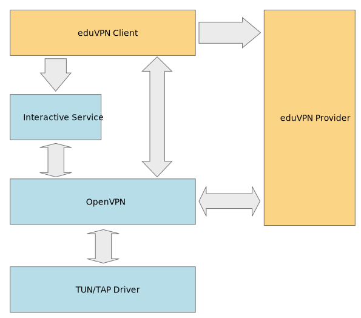
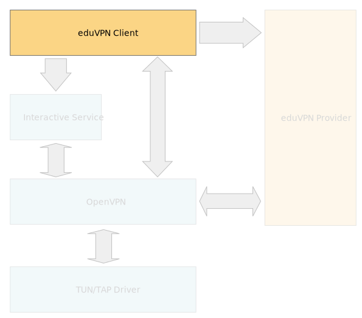
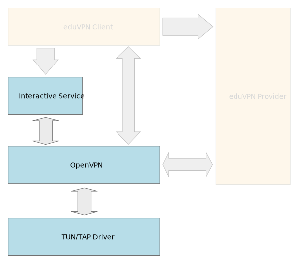
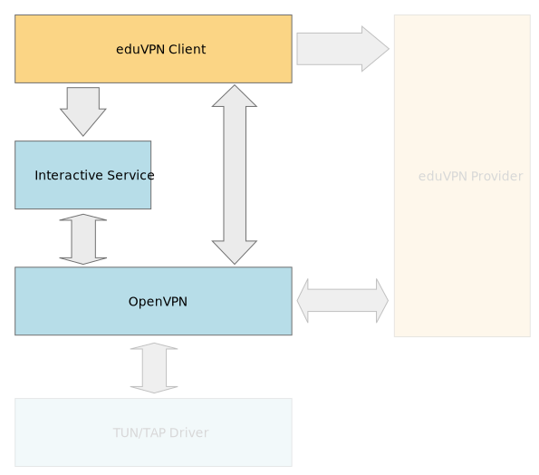
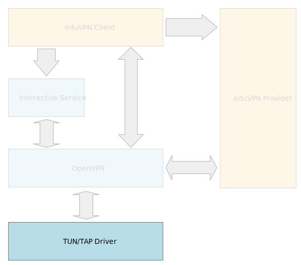

# 1. Overview

eduVPN client deployment on Windows computers requires the following features installed locally:
- eduVPN client
- OpenVPN Interactive Service
- OpenVPN
- TUN/TAP driver

Additionally, eduVPN client requires:
- .NET Framework 4.5.

# 2. Deployment Options

eduVPN client is packed as MSI package. Separate 32 and 64-bit package is available.

OpenVPN Interactive Service, OpenVPN and TUN/TAP driver is packed as standalone installer EXE.

TUN/TAP driver is available as a separate installer EXE too.

The ultimate eduVPN installer will be deployed as installer EXE to install all required features. Including .NET Framework 4.5 if not already installed.

## 2.1 Plan A

eduVPN client is installed using an MSI package:  

All OpenVPN features are installed using OpenVPN installer EXE:  

### 2.1.1 Pros

OpenVPN installer EXE is readily available.

### 2.1.2 Cons

Installing all OpenVPN features is not required. The particularly annoying features installed by default is OpenVPN GUI. Its desktop shortcut and auto-started system tray icon might confuse users to use OpenVPN GUI instead of eduVPN Client.

If OpenVPN is not installed yet, we can install only features required by eduVPN using command line switches.

The real problem is updating current OpenVPN installation. When we run the newer version of OpenVPN installer EXE, it will not detect currently installed features. It will install the default feature set over the current installation. In other words: non-default features of current installation does not get updated; and the default features previously unselected for install gets installed.

Updating OpenVPN does not preserve feature-selection. Even worse: some features might not even get updated.

Using command line switches, one can select features to update, but we should detect which features are currently installed ourself. Should user install some OpenVPN features by himself, they should be updated as well.

## 2.2 Plan B

eduVPN client is bundled with OpenVPN and own version of OpenVPN Interactive Service, and is installed using an MSI package:  

OpenVPN binaries (including DLL libraries) are upstream OpenVPN binaries:
- openvpn.exe
- libeay32.dll
- liblzo2-2.dll
- libpkcs11-helper-1.dll
- ssleay32.dll

The OpenVPN Interactive Service needs some amends to support multiple concurrent instances.

TUN/TAP drivers are installed using TUN/TAP installer EXE:  

### 2.2.1 Pros

eduVPN client becomes mostly independent of OpenVPN. Less dependency on external features bring more predictable behaviour on end user computer resulting in less help-desk cases.

Furthermore, separating eduVPN's bundled OpenVPN version from upstream OpenVPN allows user to run an old version of OpenVPN in parallel should user need a specific version for other VPN access.

### 2.2.2 Cons

The upstream OpenVPN Interactive Service does not support instantiation. Only one OpenVPN Interactive Service can run at the same time on the same computer.

To prevent collision with the upstream OpenVPN Interactive Service, the Interactive Service needs amends.

First, Microsoft Visual C++ building of OpenVPN Interactive Service using the same building environment as eduVPN (Microsoft Visual Studio 2017 Community Edition) was established. Therefore, we can make our own fork of the Interactive Service not colliding with the upstream one now.

> Note: Our changes have been submitted to the OpenVPN development team for review. There is a good chance the most important ones will get acknowledged and become standard.

As the OpenVPN Interactive Service has reached maturity, it has very low frequency of commits, making it easy for us to maintain a synchronised fork.
