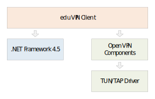

# Deployment of eduVPN Client for Windows


This document describes deploying the eduVPN Client for Windows only. For eduVPN server setup see [eduVPN Documentation](https://github.com/eduvpn/documentation).

Basic knowledge of GPO or SCCM is required.

## Overview



eduVPN Client for Windows requires:
- .NET Framework 4.5
- [TAP-Windows driver](https://openvpn.net/index.php/open-source/downloads.html)
- OpenVPN Components: `eduVPNOpenVPN_<ver>_<plat>.msi`
- eduVPN Client: `eduVPNCore_<ver>_<plat>.msi`

## Option A: EXE Installer

The `eduVPNClient_<ver>.exe` EXE installer installs all required eduVPN Client for Windows components. Binaries are published [here](https://github.com/Amebis/eduVPN/releases).

This is the recommended option for SCCM deployments.

When started with `/?` parameter, the EXE installer will display a list of supported parameters:


Action       | Description
-------------|------------------------------------
`/install`   | Installs the product. This is the default.
`/repair`    | Repairs the product.
`/uninstall` | Uninstalls the product.
`/layout`    | Downloads all web-based content to the current folder for later offline installation.

UI           | Description
-------------|---------------
_none_       | By default UI and all prompts are displayed.
`/passive`   | Displays minimal UI with no prompts. The computer is restarted automatically if required.
`/quiet`     | Displays no UI and no prompts. The computer is restarted automatically if required.

Additional flags:
- `/norestart` - Suppress any attempts to restart. By default, UI will prompt before a restart.
- `/log <logfile.txt>` - Logs to a specific file. By default, a log file is created in `%TEMP%`.

## Option B: MSI Packages

This option is recommended for Group Policy deployments. However, it automates the deployment only partially.

You need to deploy .NET Framework 4.5 and [TAP-Windows driver](https://openvpn.net/index.php/open-source/downloads.html) manually or by other automatization means first. They are available as an EXE installer only rendering them inappropriate for Group Policy deployment.

After all workstations have the .NET Framework and TAP-Windows driver installed, deploy both MSI packages:
- `eduVPNOpenVPN_<ver>_<plat>.msi`
- `eduVPNCore_<ver>_<plat>.msi`

Binaries are published [here](https://github.com/Amebis/eduVPN/releases)

Packages can be deployed using a same Group Policy Object. We advise against making `x86` versions available to Win64 machines. Please use the `x64` for Win64 machines.


# Keeping eduVPN Client Up-to-date

The eduVPN Client for Windows will self-update on new releases by default.

Should you prefer manual updating, self-updating can be turned off in the `eduVPN.Client.exe.config` XML file installed in the `eduVPN\Core` folder. At the `SelfUpdateDescr` setting, set the `Uri` attribute of `<ResourceRef>` element to an empty string:
```XML
<setting name="SelfUpdateDescr" serializeAs="Xml">
    <value>
        <ResourceRef Uri=""/>
    </value>
</setting>
```

Updating eduVPN Client for Windows manually is installing the newer version over the previous one using the same deployment option again.

Updating will overwrite the `eduVPN.Client.exe.config` file with the default one. All modifications are lost. If you want to keep self-updating disabled make sure to re-deploy your version of `eduVPN.Client.exe.config` again.
