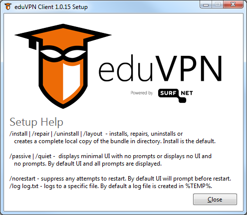

# Deployment of eduVPN and Let's Connect! Clients for Windows

This document describes deploying the eduVPN and Let's Connect! Clients for Windows only. For eduVPN server setup see [eduVPN Documentation](https://github.com/eduvpn/documentation).

eduVPN and Let's Connect! clients are the same client targeted for a different audience. While their UI is different, the setup is identical. Therefore, the remainder of this document will reference "eduVPN" only for readability. For Let's Connect! use case, the "eduVPN" in paths and filenames translates to "LetsConnect".

Basic knowledge of GPO or SCCM is required.

## Requirements

eduVPN Client for Windows requires:
- .NET Framework 4.8 or later
- eduVPN Client: `eduVPNClient_<ver>_<plat>.msi`
- Windows 7: KB2921916

## Option A: EXE Installer

The `eduVPNClient_<ver>.exe` EXE installer installs all required eduVPN Client for Windows components. Binaries are published [here](https://github.com/Amebis/eduVPN/releases).

This is the recommended option for SCCM deployments.

When started with `/?` parameter, the EXE installer will display a list of supported parameters:

Action       | Description
-------------|------------------------------------
`/install`   | Installs the product. This is the default.
`/repair`    | Repairs the product.
`/uninstall` | Uninstalls the product.
`/layout`    | Downloads all web-based content to the current folder for later offline installation.

UI             | Description
---------------|---------------
_none_         | By default UI and all prompts are displayed.
`/passive`     | Displays minimal UI with no prompts. The computer is restarted automatically if required.
`/quiet`       | Displays no UI and no prompts. The computer is restarted automatically if required.
`/lang <lcid>` | Displays UI in specified locale if available. The list of LCIDs can be found [here](https://msdn.microsoft.com/en-us/library/cc767443.aspx).

Additional flags:
- `/norestart` - Suppress any attempts to restart. By default, UI will prompt before a restart.
- `/log <logfile.txt>` - Logs to a specific file. By default, a log file is created in `%TEMP%`.

## Option B: MSI Packages

This option is recommended for Group Policy deployments. However, it automates the deployment only partially.

You need to deploy .NET Framework 4.8 or later manually or by other automatization means first. It is available as an EXE installer only rendering it inappropriate for Group Policy deployment.

After all workstations have the .NET Framework installed, deploy `eduVPNClient_<ver>_<plat>.msi` MSI package.

Binaries are published [here](https://github.com/Amebis/eduVPN/releases)

Packages can be deployed using the same Group Policy Object. We advise against making `x86` versions available to Win64 machines. Please use the `x64` for Win64 machines.

# Keeping eduVPN Client Up-to-date

The eduVPN Client for Windows will self-update on new releases by default.

Should you prefer manual updating, self-updating can be turned off in the `HKEY_LOCAL_MACHINE\SOFTWARE\SURF\eduVPN` registry key by adding a blank `REG_SZ` value named `SelfUpdateDiscovery`.

Updating eduVPN Client for Windows manually is installing a newer version over the previous one using the same deployment option again.
